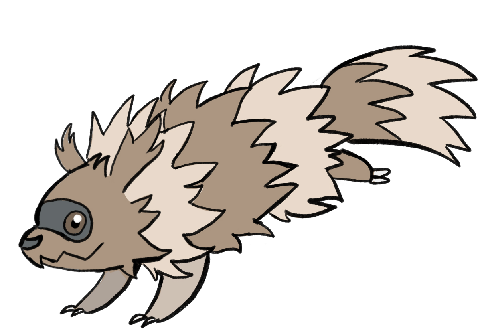

# KDE Splashscreen - Bounding Zigzagoon
A simple splash screen for plasma kde that shows a **gif** of a running zigzagoon  
Art by [@coldweatherart](https://www.instagram.com/coldweatherart/)

## Installation
To install, open your terminal,
Run `cd ~/.local/share/plasma/look-and-feel` to navigate to your KDE customisation folder.
Run `git clone https://github.com/zoonzoonzoonzoon/bounding-zigzagoon.git ~/.local/share/plasma/look-and-feel/bounding-zigzagoon/` to download this project into your KDE customisation folder

## Store page
https://www.pling.com/p/2127084/
